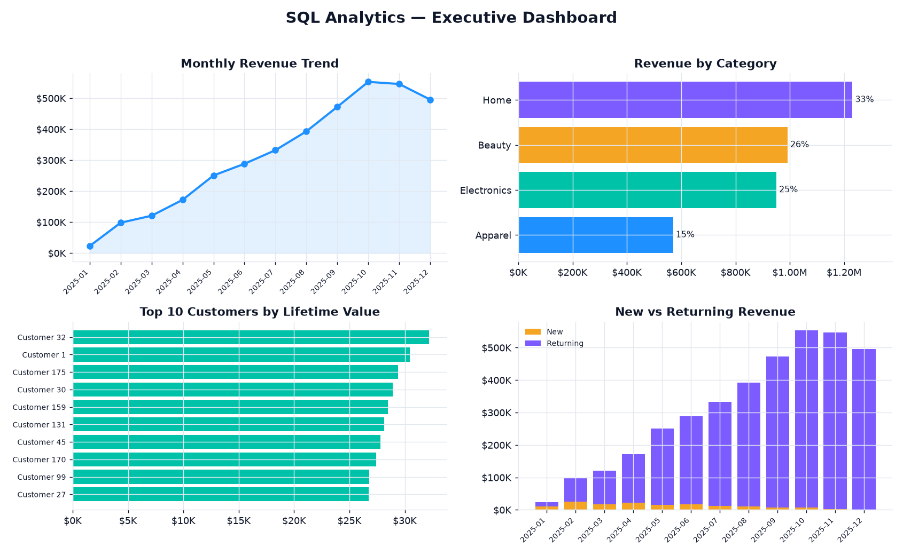
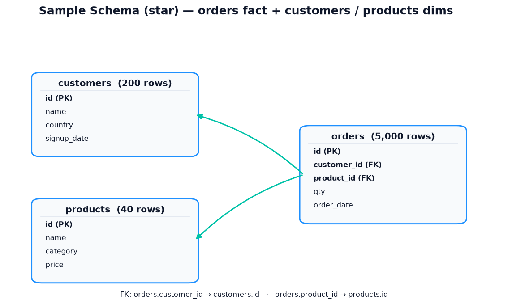

# 🗄️ SQL Analytics Portfolio

> A self-contained SQLite warehouse and a set of **analytical SQL** queries —
> window functions, CTEs, ranking, running totals, NTILE segmentation and
> cohort logic — the exact patterns I write to feed BI dashboards, runnable with
> zero third-party dependencies.

<p>
  
  
  
  
  
</p>

---

## 📊 Executive dashboard

Built from the query results (`visualize.py`) over a seeded 5,000-order database:



## 🧩 Data model

A minimal **star schema** — an `orders` fact referencing `customers` and
`products` dimensions:



---

## Why this project

Dashboards are only as good as the SQL underneath them. This repo is that layer,
on its own, so the queries can be read and judged directly: each one answers a
real commercial question with the right window function rather than pulling
everything into Python and aggregating there. It runs on **pure `sqlite3` from
the standard library** — clone, build, query — so there's nothing to install to
see the SQL work.

## Queries

| File | Technique | Business question |
|---|---|---|
| `01_monthly_revenue.sql` | `LAG()` over months | Are we growing, and how fast MoM? |
| `02_top_customers.sql` | `RANK()` over lifetime value | Who are our most valuable accounts? |
| `03_category_share.sql` | `SUM() OVER ()` | What share of revenue is each category? |
| `04_running_total.sql` | windowed cumulative frame | How does revenue accumulate daily? |
| `05_customer_segments.sql` | `NTILE(4)` quartiles | How concentrated is our revenue? |
| `06_new_vs_returning.sql` | `ROW_NUMBER()` per customer | New logos vs. repeat business over time? |

## 📈 Selected results (latest run)

**Revenue by category** — Home leads; the top two categories are ~59% of revenue:

| category | revenue | % of total |
|---|---:|---:|
| Home | $1.23M | 32.9% |
| Beauty | $0.99M | 26.5% |
| Electronics | $0.95M | 25.4% |
| Apparel | $0.57M | 15.2% |

**Customer value quartiles** (`NTILE`) — revenue is top-heavy: the top 25% of
customers drive **33.2%** of revenue at a **$24.9K** average LTV vs **$13.1K** in
the bottom quartile:

| quartile | customers | revenue | % of revenue | avg LTV |
|---|---:|---:|---:|---:|
| 1 (top) | 50 | $1.24M | 33.2% | $24,861 |
| 2 | 50 | $1.00M | 26.6% | $19,943 |
| 3 | 50 | $0.85M | 22.6% | $16,920 |
| 4 | 50 | $0.66M | 17.5% | $13,128 |

**New vs returning** — as acquisition matures, the returning share climbs from
**50.6%** (Jan) to **~100%** (Dec): the base is compounding.

> Full result tables: [`docs/results.md`](docs/results.md) and per-query CSVs
> under `outputs/results/`. Totals reconcile — grand total ≈ **$3.74M** across
> 5,000 orders. Data is seeded, so re-running reproduces these figures.

## Methodology

- **One fact, two dimensions.** `build_db.py` seeds a star schema and, for
  realism, acquires customers across the year and dates every order on or after
  its customer's `signup_date` — so the temporal queries (monthly ramp,
  new-vs-returning) show genuine shape, not random noise.
- **Compute in SQL, not Python.** Growth, ranks, shares, running totals,
  quartiles and first-order detection are all done with window functions; the
  Python is only glue (run + snapshot) and presentation (`visualize.py`).
- **Every result is snapshotted.** `run_queries.py` writes each query's full
  output to CSV plus a combined Markdown digest, so results are reviewable
  without a database.

## ▶️ Run it

```bash
python build_db.py       # creates shop.db (200 customers, 40 products, 5,000 orders)
python run_queries.py    # runs every query; prints + writes outputs/results/

# optional visuals & tests (needs: pip install -r requirements.txt)
python visualize.py      # writes outputs/dashboard.png + schema.png
pytest -q                # 8 tests
```

Running the **queries** needs only the Python standard library. `visualize.py`
and the tests add `pandas` + `matplotlib` (+ `pytest`).

## 🧪 Tests

`tests/test_queries.py` builds a fresh seeded DB and checks the SQL holds its
invariants: category shares sum to 100%, running totals are monotonic and equal
an independent cumulative sum, `RANK` is dense and ordered, `NTILE` yields four
balanced quartiles with the top out-earning the bottom, MoM change reconciles
against a recomputation, and every order post-dates its customer's signup.

## 🗂️ Project structure

```
sql-analytics-portfolio/
├── queries/               # 6 analytical SQL files (window functions, CTEs)
├── build_db.py            # seeds the SQLite star schema
├── run_queries.py         # runs queries + CSV/Markdown snapshots (stdlib only)
├── visualize.py           # house-style dashboard + ERD (pandas/matplotlib)
├── tests/
│   └── test_queries.py    # 8 SQL invariant tests
├── docs/                  # committed dashboard + ERD + result snapshots
├── requirements.txt
└── README.md
```

## 🛠️ Stack

`SQLite` · `SQL window functions` · `Python` · `pandas` · `matplotlib` · `pytest`

---

<sub>Part of my data & analytics portfolio — [github.com/syedjawaadali](https://github.com/syedjawaadali). Data is synthetic; no real data used.</sub>
